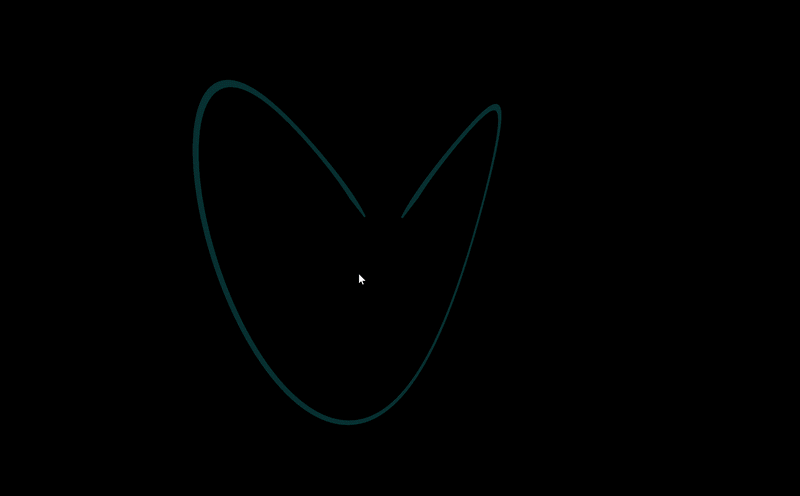

# GPU-Accelerated 3D Chaos Attractor & Butterfly Effect 🦋
A real-time high-performance 3D simulation of the **Lorenz Attractor** running entirely on the GPU using **Taichi Lang**. Simulates and renders **1,000,000 particles** simultaneously at 60+ FPS, demonstrating non-linear dynamics, differential equations, and chaotic systems.



## 🛠️ Technology Stack & Architecture
- **Language**: Python 3.x
- **Compute & Graphics API**: **Taichi Lang** (Massive parallel execution on GPU via Vulkan/CUDA/Metal)
- **Mathematical Model**: Systems of Ordinary Differential Equations (ODEs) solved via Euler integration on GPGPU.

## ✨ Technical Highlights
- **Massive Parallelism**: Computes trajectories for **1,000,000 individual particles** concurrently per frame.
- **Chaos Theory in Action**: Visualizes sensitive dependence on initial conditions (the butterfly effect) through continuous phase-space evolution.
- **Interactive 3D Camera**: Integrated real-time orbit controls via Taichi UI system.
- **Optimized Rendering**: Lightweight particle primitives with custom neon color mapping for clean visual feedback.

## ⚙️ Quick Start
1. Install dependencies:
   ```bash
   pip install taichi numpy
Run the simulation:

Bash
python app.py
🎮 Controls
Rotate Camera: Hold Right Mouse Button (RMB) and drag.